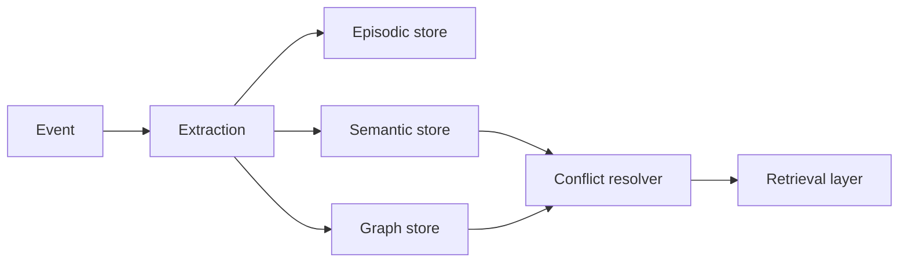

# Memory Layer R&D

Research harness for agent memory architectures: episodic events, semantic facts, graph links and conflict resolution.

## Problem

Long-running agents usually treat memory as “append everything to context.” That scales poorly, creates contradictions and makes retrieval unpredictable. This project models memory as structured stores with explicit update and retrieval rules.

## Architecture



### Memory Types

| Store | Holds | Update model |
| --- | --- | --- |
| Episodic | Recent interaction events | Append with bounded window |
| Semantic | Stable facts about users or domain | Upsert with conflict resolution |
| Graph | Relationships between concepts | Link entities for contextual retrieval |

## Design Thinking

- **Test memory like data** — retrieval and conflict behavior should have fixtures and assertions.
- **Update beats append** — contradictions should resolve, not accumulate.
- **Start simple** — deterministic stores before vector DBs or graph services.
- **Retrieval is multi-source** — answers may come from facts, links or recent events.

## Quick Start

```bash
python -m venv .venv
source .venv/bin/activate
pip install -e ".[dev]"
python -m memory_layer_rnd.demo
pytest
```

## Open Questions

- Which observations deserve durable memory versus session-only context?
- When should a new fact replace an old one instead of coexisting?
- How much should graph structure influence ranking versus semantic similarity?
- How do we benchmark memory quality beyond anecdotal prompt tests?

## Evolution Path

- Vector retrieval adapter behind the same store interface
- Temporal graph relationships inspired by Zep/Graphiti patterns
- Long-memory benchmark fixtures
- LangGraph integration with shared memory contract
