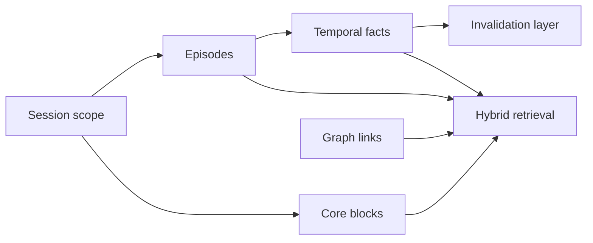

# Memory Layer R&D

Research harness for agent memory architectures, informed by studying [Mem0](https://github.com/mastroke/mem0), [Graphiti](https://github.com/mastroke/graphiti) and [Letta](https://github.com/mastroke/letta).

## Problem

Long-running agents usually treat memory as “append everything to context.” Production systems instead separate scope, time, structured blocks and retrieval behavior. This repository models those boundaries in a small testable harness.

## Architecture



### Layers

| Layer | Inspired by | Responsibility |
| --- | --- | --- |
| `SessionScope` | Mem0 | Isolate memory by user, agent and run |
| `CoreBlock` | Letta | Keep small structured memory always available |
| `Episode` | Graphiti | Timestamped source events with `reference_time` |
| `TemporalFact` | Graphiti | Facts with `valid_at` / `invalid_at` |
| `MemoryHarness` | All three | Orchestrates ingest, invalidation and retrieval |

## Design Thinking

- **Scope before storage** — every write and read should know which actor/session it belongs to.
- **Time is part of truth** — ask what was valid at `T`, not only what exists now.
- **Contradictions should invalidate** — preserve history without keeping stale facts active.
- **Blocks vs recall vs facts** — not everything belongs in the same memory tier.
- **Learn upstream, implement minimally** — see [docs/upstream-learning.md](docs/upstream-learning.md).

## Quick Start

```bash
python -m venv .venv
source .venv/bin/activate
pip install -e ".[dev]"
python -m memory_layer_rnd.demo
pytest
```

## Example

```python
from memory_layer_rnd import MemoryHarness, SessionScope

harness = MemoryHarness(scope=SessionScope(user_id="u1", agent_id="planner"))
harness.remember_episode("User wants temporal memory", reference_time="2026-06-01T10:00:00+00:00")
harness.add_fact("focus", "vector-only memory", reference_time="2026-06-01T10:05:00+00:00")
harness.add_fact("focus", "temporal facts with invalidation", reference_time="2026-06-15T09:00:00+00:00")

print(harness.active_facts_at("2026-06-05T00:00:00+00:00"))
print(harness.retrieve("temporal memory focus"))
```

## Upstream Study Repos

- [mastroke/mem0](https://github.com/mastroke/mem0)
- [mastroke/graphiti](https://github.com/mastroke/graphiti)
- [mastroke/letta](https://github.com/mastroke/letta)

## Evolution Path

- LongMemEval-style replay fixtures
- Mem0 extraction adapter
- Graphiti entity-edge retrieval boosts
- Letta recall compaction for long episode histories
