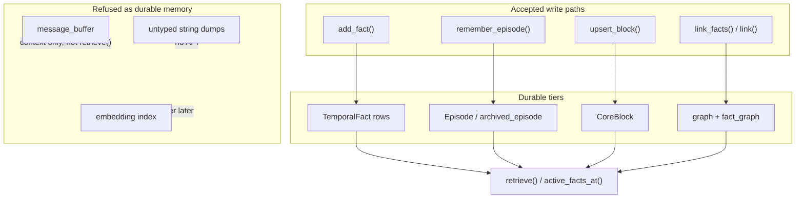

# ADR 0009: Memory-As-Contract Boundaries

## Status

Accepted

## Context

Prior ADRs added temporal facts, scoped episodes, blocks, dedup, decay, graph
links and conflict resolution. Each feature expanded what the harness *can* store,
but callers still need a single place that states what the memory layer
**guarantees** versus what it **refuses** to treat as durable memory.

Without explicit boundaries, agents fall back to transcript dumps: every token
lands in context, scope leaks across users, and retrieval becomes an unbounded
search over chat history. Production memory systems instead expose a contract:
typed tiers, visible write outcomes, and a clear refusal surface for content that
does not belong in the store.

## Decision

Treat `MemoryHarness` as a **contract**, not a transcript archive. The harness
accepts writes only through tier-specific APIs and exposes deterministic
read paths. Everything else is out of scope for this layer.

### Memory tiers (what belongs)

| Tier | Write API | Durable? | Retrieval surface |
| --- | --- | --- | --- |
| `TemporalFact` | `add_fact()` | Yes — invalidated rows kept with `invalid_at` | `active_facts_at()`, `retrieve()` |
| `Episode` | `remember_episode()` | Yes — active window + optional archive | `episodes_before()`, `retrieve()` |
| `CoreBlock` | `upsert_block()` | Yes — labeled structured slots | `retrieve()`, `CoreBlock.render()` |
| Lexical graph | `link()` | Yes — subject→target strings | `retrieve()` |
| Fact graph | `link_facts()` | Yes — edges between stored fact ids | `recall_related()`, `retrieve()` |
| Archived episode | `compact_episodes()` | Yes — moved to `archived_episodes` | Indirect via `recall_summary` block |

Each tier is isolated. Callers must choose the tier; the harness does not infer
one from unstructured input.

### Guarantees

1. **Explicit write outcomes** — `add_fact()` returns `AddFactResult` with
   `action` in `{created, duplicate, merged, superseded, rejected}` so callers
   know whether state changed.
2. **Scope before storage** — every `Episode` carries `SessionScope`; facts and
   blocks live inside a scoped harness instance. Cross-scope isolation is the
   caller's responsibility (one harness per scope).
3. **Temporal truth** — facts expose `valid_at` / `invalid_at`; `active_facts_at(T)`
   answers what was believed at `T`, not only what exists now.
4. **Contradiction invalidation** — conflicting active facts on the same subject
   resolve via `ConflictStrategy` (ADR 0007); superseded rows remain in the store
   with provenance links in `linked_ids`.
5. **Dedup gates on write** — exact hash duplicates return `duplicate`; lexical
   near-duplicates on the same subject merge unless a contradiction is detected
   (ADR 0004).
6. **Tier-appropriate retrieval** — `retrieve()` fuses facts, graph edges,
   episodes, and blocks. It does not search arbitrary internal buffers.
7. **Deterministic in-process behavior** — no vector DB, graph DB or LLM required
   to satisfy the contract; adapters may wrap the same tests later (ADR 0001).

### Refusals (what the layer will not store or surface)

| Refused content | Rationale | Caller alternative |
| --- | --- | --- |
| Raw message / transcript buffer | `message_buffer` holds the last 10 strings for extraction context only; it is not indexed or returned by `retrieve()` | `remember_episode()` for durable events; external log for full transcripts |
| Unscoped writes | `SessionScope` requires at least one of `user_id`, `agent_id`, `run_id` | Construct scope before creating the harness |
| Implicit tier assignment | No API accepts “store this string somewhere” without a tier | Pick `add_fact`, `remember_episode`, or `upsert_block` |
| Cross-subject semantic dedup | Near-duplicate merge runs within one subject only | Normalize subjects upstream or use an embedding adapter |
| Embedding / vector similarity | Lexical overlap only in this harness | Adapter behind `retrieve()` with eval fixtures (ADR 0008) |
| LLM-extracted entities | No automatic NER or relation extraction | Caller or Mem0 adapter supplies `(subject, fact)` |
| Calibrated truth scores | `confidence` is a caller-provided scalar, not a model posterior | Map extractor output in an adapter |
| Full contradiction semantics | `_contradicts()` uses negation tokens and prefix heuristics only | Stronger NLU belongs outside the harness |
| Binary / media payloads | Text-only `str` fields | Store references (URIs, ids) as facts |
| Unbounded active episode window | Long histories require `compact_episodes()` | Compact or archive; provenance stays in `archived_episodes` |
| Persistent / replicated storage | In-memory lists and dicts | Wrap harness or sync to Postgres/Neo4j in an adapter |
| Secrets as special-case | No encryption, redaction, or vault semantics | Redact before write; use a secrets store |

Refusal here means the harness **does not promise** to durably store, index, or
retrieve that content. Passing a secret string into `add_fact()` will store it
like any other string — the contract refuses to add security semantics, not to
accept arbitrary text.

### Boundary diagram

## Consequences

- Callers can reason about memory without reading the full harness implementation.
- Contract tests in `contract.py` and `tests/test_contract.py` encode the
  testable refusals (e.g. buffer excluded from retrieval) so adapters cannot
  regress boundaries silently.
- Features that need transcript search, embeddings, or persistence must live in
  adapters documented separately — they extend the contract, they do not widen
  the default refusal surface.
- README and upstream-learning notes link here as the canonical boundary reference.
